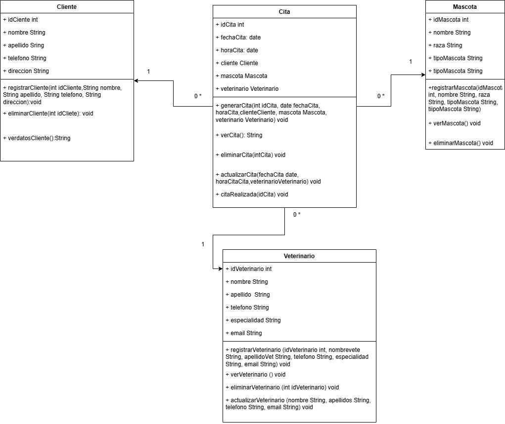

# 📚 Sistema de Gestión de Citas para Clínica Veterinaria

Este proyecto está desarrollado en Java con enfoque orientado a objetos, aplicando principios de arquitectura en capas y modelado UML. Su propósito es permitir la gestión eficiente de clientes, mascotas, veterinarios y citas médicas dentro de una clínica veterinaria.

---

## 🧩 Diagrama de clases UML

---

## 📌 Funcionalidades

- Registro y gestión de clientes
- Registro de mascotas
- Asignación de veterinarios
- Programación, actualización, cancelación y eliminación de citas
- Visualización de datos estructurados

---

## 📁 Estructura del proyecto

- `/UML` → Diagramas de clases y casos de uso
- `README.md` → Documentación principal
- `Requisitos.md` → Requerimientos funcionales y no funcionales
- `src/` → Código fuente (próximamente)

---
## 📊 Arquitectura del sistema

El sistema sigue una estructura en capas basada en el patrón MVC (Modelo - Vista - Controlador), lo cual permite separar la lógica del negocio, la presentación y los datos.

---

## 🔧 Tecnologías utilizadas

- Java SE
- UML (draw.io)
- NetBeans IDE
- GitHub

---

## ✨ Estado del proyecto

📌 En fase de modelado.  
📌 Desarrollo de clases y funcionalidades en proceso.

---

## 👩‍💻 Autor

Sandra G.  
GitHub: [SandraG-Java81](https://github.com/SandraG-Java81)
